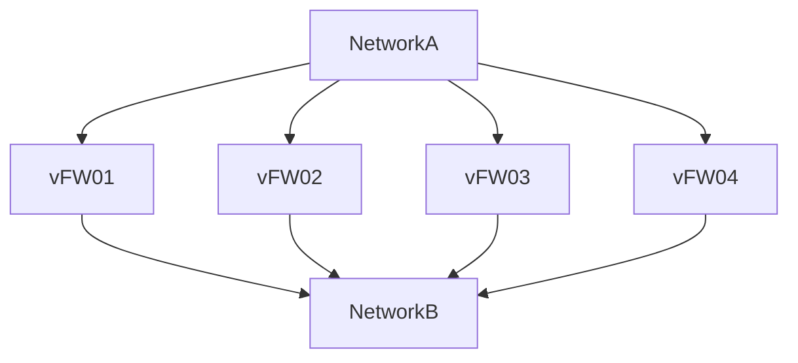

## Overview
This documents in Contrail 3.x & Contrail 2.x environments (via "Tags" & "Roles"), how to perform In-Service upgrade of vSRX Service Instance vFW's (ECMP Scale-Out Scenario) in an automated fashion to Juniper JUNOS 15.1X49-D70.3 (though it could be used to migrate to other versions of JUNOS). In our lab, it took about ~1.5 hour per vSRX VM upgrade via the Upgrade method and ~20min via the Rebuild method.



## Version 1.2
This version of the playbooks is intended to work with Ansible 2.3.x and Juniper.JUNOS stdlib 1.4.2

## Methods
* __REBUILD__: This uses the Ansible 2.3+ Cloud Module os_server_actions and calls the "rebuild" which is analogous to the "nova rebuild" command. This requires a QCOW2 image be preconfigured and available in your TENANT with FXP0 set to dhcp-client and a user created for automated admin access (SSH-KEY or User/Pass) to reconfigure the vSRX VM with a previously saved config.
  - Rebuild method is supported in Contrail 2.x and 3.x environments via the TAGS __'--tags "c2x,rebuild"'__ and __'--tags "c3x,rebuild"'__ input upon running the playbook __c2x-vsrx_code.yml__.
* __UPGRADE__: This uses the Juniper.junos_install_os Module to push the TGZ upgrade binaries to the vSRX VM and then run install scripts.
  - Upgrade method is supported in Contrail 2.x and 3.x environments via the TAGS __'--tags "c2x,upgrade"'__ and __'--tags "c3x,upgrade"'__ input upon running the playbook __c3x-vsrx_code.yml__.

## Tags
Instead of using different __ROLES__ to differntiate between the different types of vSRX Code Migrations, using __TAGS__ allows us to consolidate the vasious tasks into a single __ROLE__. Below are some TAGS we have used:

* __c2x__: Contrail 2.x
* __c3x__: Contrail 3.x
* __rebuild__: Migrate vSRX Code via REBUILD Method
* __upgrade__: Migrate vSRX Code via UPGRADE Method
* __reboot.c2x__: Reboot vSRX in Contrail 2.x
* __reboot.c3x__: Reboot vSRX in Contrail 3.x
* __vmi_down.c2x__: Shut down Service-Chained VMI's in Contrail 2.x
* __vmi_down.c3x__: Shut down Service-Chained VMI's in Contrail 3.x
* __vmi_up.c2x__: Admin up Service-Chained VMI's in Contrail 2.x
* __vmi_up.c3x__: Admin up Service-Chained VMI's in Contrail 3.x

## GitHub:
> https://github.com/F0otsh0T/ansible-vsrx_upgrade/

## System and Software Requirements

  >  * sudo -H apt-get install software-properties-common
  >  * sudo -H apt-get install python
  >  * sudo wget https://raw.github.com/pypa/pip/master/contrib/get-pip.py and/or wget https://bootstrap.pypa.io/get-pip.py
  >  * sudo -H python get-pip.py
  >  * sudo -H apt-add-repository ppa:ansible/ansible
  >  * sudo -H apt-get update
  >  * Python >= 2.7 Python Modules (use pip to install)
  >    - sudo -H pip --proxy={{ PROXY }} install shade --process-dependency-links
  >      + May require updated pbr
  >      + May require lxml
  >      + May require libssl-dev
  >      + May require libffi-dev
  >      + May require updated pip
  >  * sudo -H pip --proxy={{ PROXY }} install jxmlease --process-dependency-links
  >    - junos-eznc
  >    - junos-netconify
  >    - ncclient
  >    - pycrypt
  >    - cryptography
  >  * sudo -H apt-get install ansible
  >    - Ansible >= 2.3.0 (or use PIP to install Ansible)
  >    - (Optional) ansible-doc
  >    - Ansible Module (use ansible-galaxy): Juniper.junos >= 1.4.2
  >  * sudo -H sudo ansible-galaxy install git+https://github.com/Juniper/ansible-junos-stdlib.git,,Juniper.junos
  >  * sudo -H apt-get install whois (for mkpasswd)

Also, if you're running Pre-Ansible 2.3.x, you'll need to pull down a Ansible 2.3.x RC version of the following files:

* /usr/local/lib/python2.7/dist-packages/ansible/modules/core/cloud/openstack/os_server_actions.py
* /usr/local/lib/python2.7/dist-packages/ansible/modules/core/cloud/openstack/os_server_actions.pyc

## Prerequisites

* Accounts for Juniper and OpenStack (with Admin access to shut down OS::Neutron::Ports)
  - Ansible OpenStack Modules: OpenStack Keystone account with Admin Access to your Tenant & Neutron Networks / Ports. This will be used to disable and re-enable OS::NEUTRON:PORT(s) during the upgrade.
  - Ansible Juniper_OS Modules: Local vSRX account or AAA account with SSH Keys configured.  This will be used to perform operations on the vSRX itself during the upgrade.

* Create SSH Keys for MechID account on Linux host
  - Naming of Public and Private keys are important due to a bug in the Ansible Juniper.junos module ( https://github.com/Juniper/ansible-junos-stdlib/issues/85 ). The bug the prevents usage of keys named anything other than:
    ```ssh
    Private: id_rsa
    Public: id_rsa.pub
    ```
  - Please note: If you use anything other than the stock/default id_rsa* keys in your ~/<home>/.ssh directory, you will need to specify the location and files of the SSH keys in the ansible.cfg file, other variable file, or via command line during ansible-playbook execution.

* Configure vSRX with MechID account with SSH-KEY and NetConf via SSH (Alternatively, use User/Pass instead of SSH-KEY).
  - vSRX user should have full access / admin rights to perform upgrades.
  - E.g.
    ```junos
    system {
          login {
              user username {
              full-name "Ansible and Automation MechID";
              uid 1111;
              class super-user;
              authentication {
                  encrypted-password "encrypted""; ## SECRET-DATA
                  ssh-rsa "ssh-rsa as;dklfja;slkfj;laskdjf;laksjdf;klasflkjas;ldfha;eiohfrqwoifhajsvn;asf;oha;wehf;ahf;klashd;flhas;ldhf;alshdfklhas;dfhalskdfh;lakshd;fklhasd;fhas;ldhfaklshdfklahsd;lfha;skldhf;laskhdf;klhasd;flhas;lvas;lvn;awepfoihweofhaosnv;lasnd;lfniowehfoavkljansd;lnas;dofhoaasjdflansd;fqwherf28yrp891h;oasv;akjsnv;asdf;ohasofhapowehfpauaohifoasidhf;lashdf;kashdf;ahsd;fhaposdhfpoasihdfoa user@domain"; ## SECRET-DATA
                  }
              }
          }
          services {
              netconf {
                  ssh;
                  }
              }
          }
    ```

* __[UPGRADE METHOD]__ For the Juniper.junos_install_os Upgrade method, download TARGET and CURRENT JUNOS upgrade TGZ to ~/files/ folder (or set symlink). Current JUNOS TGZ can be used for software rollback using the same process to upgrade since "request system rollback" no longer functions as of JUNOS 15.1.
* __[REBUILD METHOD]__ For the "nova rebuild" Reduild method, create a QCOW2 snapshot with your Target Code and preconfigure FXP0 for dhcp-client and user previously created for same access method (SSH-KEY or User/Pass).

## Ansible Modules Utilized

We will be utilizing native Ansible OpenStack modules (subset of Ansible Cloud Modules) and Juniper.junos modules:
* Ansible Cloud OpenStack & Networking JUNOS:
  >  - https://docs.ansible.com/ansible/list_of_cloud_modules.html#openstack
  >  - https://docs.ansible.com/ansible/os_port_module.html
  >  - https://docs.ansible.com/ansible/junos_command_module.html
  >  - https://docs.ansible.com/ansible/junos_config_module.html
* Juniper.junos:
  > - https://github.com/Juniper/ansible-junos-stdlib
  > - https://www.juniper.net/techpubs/en_US/release-independent/junos-ansible/information-products/pathway-pages/index.html
  > - https://junos-ansible-modules.readthedocs.io/en/1.4.0/
  > - https://junos-ansible-modules.readthedocs.io/en/1.4.0/junos_cli.html
  > - https://junos-ansible-modules.readthedocs.io/en/1.4.0/junos_get_config.html
  > - https://junos-ansible-modules.readthedocs.io/en/1.4.0/junos_install_os.html
  > - https://junos-ansible-modules.readthedocs.io/en/1.4.0/junos_shutdown.html
  > - https://junos-ansible-modules.readthedocs.io/en/1.4.0/junos_get_facts.html

## Inventory Hosts

The Hosts file will be used to feed variables ( {{ inventory_hostname}} & {{ ansible_host }} ) to Ansible Plays and Tasks for list of vSRX's to be upgraded. The {{ inventory_hostname }} will be used by the Ansible OpenStack Modules so this needs to be the name of the VM in OpenStack Nova.  The {{ ansible_host }} will be used by the Ansible Juniper.junos Modules and this will be the IP of the VM's FXP0 / Management Neutron Port.

We are investigating the possibility of automating the generation of the Hosts file using a modified version of the Dynamic Host Inventory script documented at:
> https://docs.ansible.com/ansible/intro_dynamic_inventory.html#example-openstack-external-inventory-script
> https://raw.githubusercontent.com/ansible/ansible/devel/contrib/inventory/openstack.py

## Logs, Debug, Output, and Config
* ~/log/: Logs generally are Ansible logs for the Play or Task
* ~/log/config/: Config to be used after Rebuild
* ~/log/debug/: Debug are typically StdOut from each Task
* ~/log/output/: Output is the content generated from each Module used in the Tasks

## Roles
The roles previously used have been consolidated into a single vsrx_code role and will utilize TAGS to differentiate between Contrail 2.x and Rebuild/Upgrade methods.

## Executing the Ansible Playbook

###### Environment-Specific Variables & Hosts Required
* ~/hosts file needs to be populated with OS::NOVA::SERVER names of the vSRX VM's in OpenStack as well as the IP's as shown in the inventory hosts file example.
* Open Stack OpenRC variables set to specific LCP/Tenant/AuthURL/User for your environment

###### Syntax & Usage (Contrail 3.x Environment, Rebuild)
```shell
#Eg.: ansible-playbook c3x-vsrx_code.yml --ask-vault-pass [-vvvv] --tags "c3x,rebuild" [--syntax-check]

ansibleserver:~/ansible-vsrx_upgrade$ ansible-playbook c3x-vsrx_code.yml --ask-vault-pass --tags "c3x,rebuild"
Vault password:
OpenStack User:
OpenStack Password:
PLAY [c3x-vsrx_code-playbook] ************************************************
TASK [setup] *******************************************************************
ok: [devsrxcnc001]
```

###### Syntax & Usage (Contrail 2.x Environment, Rebuild)
```shell
#Eg.: ansible-playbook c2x-vsrx_code.yml --ask-vault-pass [-vvvv] --tags "c2x,rebuild" [--syntax-check]

ansibleserver:~/ansible-vsrx_upgrade$ ansible-playbook c2x-vsrx_code.yml --ask-vault-pass --tags "c2x,rebuild"
Vault password:
OpenStack User:
OpenStack Password:
PLAY [c2x-vsrx_code-playbook] ************************************************
TASK [setup] *******************************************************************
ok: [prdsrxcnc001]
```

###### Syntax & Usage (Contrail 3.x Environment, UPgrade)
```shell
#Eg.: ansible-playbook c3x-vsrx_code.yml --ask-vault-pass [-vvvv] --tags "c3x,upgrade" [--syntax-check]

ansibleserver:~/ansible-vsrx_upgrade$ ansible-playbook c3x-vsrx_code.yml --ask-vault-pass --tags "c3x,upgrade"
Vault password:
OpenStack User:
OpenStack Password:
PLAY [c3x-vsrx_code-playbook] ************************************************
TASK [setup] *******************************************************************
ok: [devsrxcnc001]
```

###### Syntax & Usage (Contrail 2.x Environment, Upgrade)
```shell
#Eg.: ansible-playbook c2x-vsrx_code.yml --ask-vault-pass [-vvvv] --tags "c2x,upgrade" [--syntax-check]

ansibleserver:~/ansible-vsrx_upgrade$ ansible-playbook c2x-vsrx_code.yml --ask-vault-pass --tags "c2x,upgrade"
Vault password:
OpenStack User:
OpenStack Password:
PLAY [c2x-vsrx_code-playbook] ************************************************
TASK [setup] *******************************************************************
ok: [prdsrxcnc001]
```


## References

> * https://www.ansible.com/blog/ansible-best-practices-essentials
> * https://docs.ansible.com/ansible/playbooks_best_practices.html
> * https://docs.ansible.com/ansible/playbooks_vault.html
> * https://docs.ansible.com/ansible/list_of_cloud_modules.html#openstack
> * https://www.juniper.net/techpubs/en_US/release-independent/junos-ansible/information-products/pathway-pages/index.html
> * https://github.com/Juniper/ansible-junos-stdlib
> * https://serversforhackers.com/an-ansible-tutorial
> * https://serversforhackers.com/series/ansible
> * http://www.ansiblebook.com/
